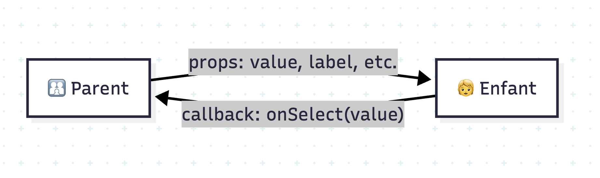

## 3.1 Flux de données unidirectionnel ↘️

Les données vont **du parent vers l’enfant** via les **props**.

```tsx
type AvatarProps = { src: string; size?: number; alt?: string }

export function Avatar({ src, size = 40, alt = "avatar" }: AvatarProps) {
  return 
}
```

## 3.2 Props obligatoires vs optionnelles ✅

- Utiliser `?` pour les **props optionnelles**.
- Fournir des **valeurs par défaut** quand pertinent.

## 3.3 Children et composition 🧩

```tsx
type PanelProps = { title: string; children: React.ReactNode }

export function Panel({ title, children }: PanelProps) {
  return (
    <section>
      <h2>📦 {title}</h2>
      <div>{children}</div>
    </section>
  )
}
```

## 3.4 Prop drilling & alternatives 🪜

**Prop drilling** = passer des props à travers plusieurs niveaux.  
Alternatives : **contexte** (`useContext`), **state management** (Zustand, Redux), **hooks personnalisés**.

## 3.5 Patterns de composition avancés 🧠

- **Render Props** : passer une fonction comme enfant.
- **Compound Components** : regrouper des sous-composants.

```tsx
type ListProps<T> = {
  items: T[]
  renderItem: (item: T) => React.ReactNode
}

export function List<T>({ items, renderItem }: ListProps<T>) {
  return <ul>{items.map(renderItem)}</ul>
}
```

## 3.6 Typage des props avec TS 🛡️

- Préférer **types explicites** pour les composants publics.
- Utiliser `React.ComponentProps<typeof Comp>` pour **hériter** des props.

```tsx
type InputProps = React.ComponentProps<"input"> & { label: string }

export function LabeledInput({ label, id, ...rest }: InputProps) {
  const htmlId = id ?? label.toLowerCase().replace(/\s+/g, "-")
  return (
    <label htmlFor={htmlId}>
      <span>🏷 {label}</span>
      <input id={htmlId} {...rest} />
    </label>
  )
}
```



---

> ✅ **À retenir**
>
> - Props = API publique d’un composant.
> - Préférer la **composition** aux hiérarchies lourdes.
> - TypeScript clarifie et sécurise l’usage des composants.
