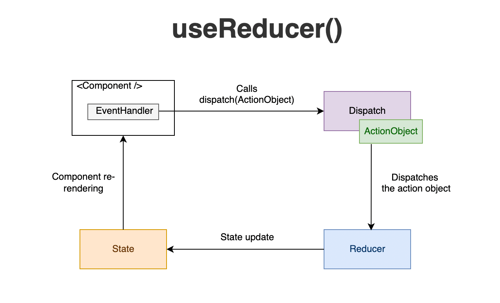

## 4.1 useState : le cœur réactif ❤️

```tsx
import { useState } from "react"

export default function Counter() {
  const [count, setCount] = useState<number>(0)
  return (
    <div>
      <p>🔢 Compteur : {count}</p>
      <button onClick={() => setCount((c) => c + 1)}>➕ Incrémenter</button>
    </div>
  )
}
```

💡 **Astuce** : Utilise la **forme fonctionnelle** `setState(prev => ...)` pour éviter les **race conditions** quand plusieurs mises à jour se produisent.

## 4.2 Immuabilité 🧊

Toujours **créer de nouveaux objets/tableaux** pour déclencher un nouveau rendu.

```tsx
const [todos, setTodos] = useState<string[]>([])
function addTodo(item: string) {
  setTodos((prev) => [...prev, item]) // ✅
}
```

## 4.3 Lifting state (remonter l’état) ⤴️

Partage d’état entre composants **via le parent**.

```tsx
function SearchBox({
  query,
  onQueryChange,
}: {
  query: string
  onQueryChange: (q: string) => void
}) {
  return (
    <input
      value={query}
      onChange={(e) => onQueryChange(e.target.value)}
      placeholder="🔎 Rechercher..."
    />
  )
}

function SearchableList({ items }: { items: string[] }) {
  const [query, setQuery] = useState("")
  const filtered = items.filter((i) => i.toLowerCase().includes(query.toLowerCase()))
  return (
    <div>
      <SearchBox query={query} onQueryChange={setQuery} />
      <ul>
        {filtered.map((i) => (
          <li key={i}>• {i}</li>
        ))}
      </ul>
    </div>
  )
}
```

## 4.4 Formulaires contrôlés 📝

```tsx
type FormData = { email: string; password: string }

export function LoginForm() {
  const [form, setForm] = useState<FormData>({ email: "", password: "" })
  return (
    <form
      onSubmit={(e) => {
        e.preventDefault()
        alert(JSON.stringify(form))
      }}
    >
      <input
        type="email"
        value={form.email}
        onChange={(e) => setForm((f) => ({ ...f, email: e.target.value }))}
        placeholder="✉️ Email"
      />
      <input
        type="password"
        value={form.password}
        onChange={(e) => setForm((f) => ({ ...f, password: e.target.value }))}
        placeholder="🔒 Mot de passe"
      />
      <button>Se connecter</button>
    </form>
  )
}
```

## 4.5 useReducer : états complexes 🧩

```tsx
type State = { count: number }
type Action = { type: "inc" } | { type: "dec" } | { type: "reset" }

function reducer(state: State, action: Action): State {
  switch (action.type) {
    case "inc":
      return { count: state.count + 1 }
    case "dec":
      return { count: state.count - 1 }
    case "reset":
      return { count: 0 }
  }
}

export function CounterPro() {
  const [state, dispatch] = React.useReducer(reducer, { count: 0 })
  return (
    <div>
      <p>🧮 {state.count}</p>
      <button onClick={() => dispatch({ type: "dec" })}>➖</button>
      <button onClick={() => dispatch({ type: "inc" })}>➕</button>
      <button onClick={() => dispatch({ type: "reset" })}>♻️</button>
    </div>
  )
}
```



---

> ✅ **À retenir**
>
> - `useState` pour états simples, `useReducer` pour états **composites**.
> - Immuabilité = rendu fiable.
> - Lever l’état au parent pour synchroniser plusieurs enfants.
