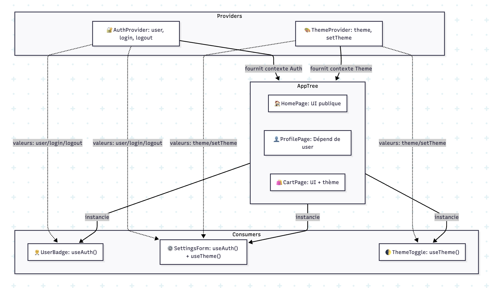

## 8.1 Contexte (useContext) 🌐

Partage de **valeurs globales** (thème, user, locale) sans prop drilling.

```tsx
type Theme = "light" | "dark"
const ThemeContext = React.createContext<Theme>("light")

export function ThemeProvider({ children }: { children: React.ReactNode }) {
  const [theme, setTheme] = React.useState<Theme>("light")
  const value = React.useMemo(() => theme, [theme])
  return <ThemeContext.Provider value={value}>{children}</ThemeContext.Provider>
}

export function UseThemeButton() {
  const theme = React.useContext(ThemeContext)
  return <button>🎨 Thème courant : {theme}</button>
}
```

⚠️ **Attention** : Les changements de contexte **re-rendent** tous les consommateurs → bien **scoper** les providers.

## 8.2 Router (react-router-dom) 🧭

```tsx
import { createBrowserRouter, RouterProvider, Link } from "react-router-dom"

const router = createBrowserRouter([
  { path: "/", element: <h1>🏠 Accueil</h1> },
  { path: "/users", element: <h1>👥 Utilisateurs</h1> },
])

export default function App() {
  return (
    <>
      <nav>
        <Link to="/">Accueil</Link> • <Link to="/users">Utilisateurs</Link>
      </nav>
      <RouterProvider router={router} />
    </>
  )
}
```

## 8.3 Optimisation : memo, useMemo, useCallback ⚙️

Réduire les **re-renders** inutiles quand les props ne changent pas.

```tsx
type ItemProps = { value: string; onSelect: (v: string) => void }

const Item = React.memo(function Item({ value, onSelect }: ItemProps) {
  return <li onClick={() => onSelect(value)}>• {value}</li>
})

export function List({ items }: { items: string[] }) {
  const [selected, setSelected] = React.useState<string | null>(null)
  const handleSelect = React.useCallback((v: string) => setSelected(v), [])
  return (
    <ul>
      {items.map((v) => (
        <Item key={v} value={v} onSelect={handleSelect} />
      ))}
    </ul>
  )
}
```

## 8.4 Accessibilité (a11y) ♿

- Utiliser les **bons rôles ARIA** et balises sémantiques.
- Gérer le **focus** et la navigation clavier.
- Assurer des **contrastes** suffisants.

```tsx
export function Modal({
  open,
  onClose,
  children,
}: {
  open: boolean
  onClose: () => void
  children: React.ReactNode
}) {
  const ref = React.useRef<HTMLDivElement>(null)
  React.useEffect(() => {
    if (!open) return
    const handler = (e: KeyboardEvent) => e.key === "Escape" && onClose()
    document.addEventListener("keydown", handler)
    return () => document.removeEventListener("keydown", handler)
  }, [open, onClose])
  if (!open) return null
  return (
    <div role="dialog" aria-modal="true" ref={ref} tabIndex={-1}>
      <button onClick={onClose} aria-label="Fermer">
        ✖️
      </button>
      {children}
    </div>
  )
}
```

## 8.5 Hooks personnalisés avancés 🧠

```tsx
function useDebouncedValue<T>(value: T, delay = 300) {
  const [debounced, setDebounced] = React.useState(value)
  React.useEffect(() => {
    const id = setTimeout(() => setDebounced(value), delay)
    return () => clearTimeout(id)
  }, [value, delay])
  return debounced
}
```



---

> ✅ **À retenir**
>
> - Contexte pour le **partage global**, avec parcimonie.
> - Router pour la navigation, memoization pour la perf.
> - A11y n’est pas optionnelle.
